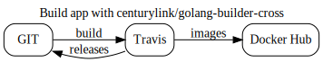

# [](https://travis-ci.org/bvberkum/x-docker-hub-build-monitor)    
###### master:  latest:   release: 
###### dev:   

##### Version: 0.0.2

- Fork of [cpuguy83/docker-hub-buildtag](/cpuguy83/docker-hub-buildtag) updated
- Generates build status tags for Dockerhub automated builds
- TODO: cache and write out JSON for build log

Rewrote original project and containerized, with some help from [Building Minimal Docker Containers for Go Applications](https://blog.codeship.com/building-minimal-docker-containers-for-go-applications/)



### Usage
```bash
docker run --rm bvberkum/hubmon -h
```

```bash
docker run -d --name redis redis
docker run --link redis:db -p 8123:80 bvberkum/hubmon -redis db:6379 -cache-timeout 10
```

```markdown
[](https://hub.docker.com/r/bvberkum/hubmon)
```

### Test
```bash
sh ./test.sh
```

#### Travis
```bash
test -x "/usr/local/bin/travis" || gem install travis
. ./travis-setenv.sh
travis setup releases
```
